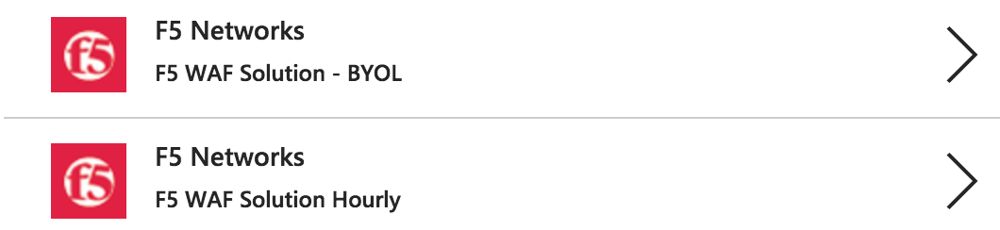

**Implementing and Operating**

**F5 BIG-IP in Microsoft Azure**

|image0|\ **
**\ |image1|

Lab 1 – Deploy a standalone F5 BIG-IP Application Delivery Controller in Azure
==============================================================================

In this lab you will be deploying a standalone F5 BIG-IP in Azure to sit
in front of an instance of WordPress.

In this lab, you will complete the following steps:

-  Generate SSH keys for CLI access to the F5 BIG-IP and WordPress
   Server

-  Deploy a standalone F5 BIG-IP in Azure

-  Modify the Security Group for the F5 BIG-IP to permit appropriate
   network access

-  License and apply a base F5 BIG-IP configuration

-  Deploy and configure a WordPress instance within Azure

-  Secure access to the WordPress instance by routing all traffic
   through the BIG-IP instance

Step 1. Create an SSH Key Pair
------------------------------

Before you begin the deployment process, you first need to generate an
SSH Key Pair which will be used for authentication to the F5 BIG-IPs in
this and subsequent labs.

**For Linux / Mac Users:**

-  From CLI

+----------------------------------------------------------------+
| ssh-keygen -t rsa                                              |
|                                                                |
| Generating public/private rsa key pair.                        |
|                                                                |
| Enter file in which to save the key (…./id\_rsa): /tmp/azure   |
+================================================================+
+----------------------------------------------------------------+

Result:

Your identification has been saved in /tmp/azure.

Your public key has been saved in /tmp/azure.pub.

Example:

|image2|

Example public RSA key Linux / Mac:

|image3|

**For Windows Users:**

-  Use PuTTY

Create SSH keys using WinSCP (PuTTY)

Open PuTTYgen and accept all defaults.

|image4|

Click “Generate”.

Save both Public and Private keys (do not protect with passphrase) in an
easy accessible place on your laptop.

|image5|

Click “Save public key” and “Save private key”.

Example public RSA key Windows:

|image6|

LATER STEP: When making a connection to WordPress using SSH during the
Lab, load the Private Key into PuTTY.

From PuTTY, go to “Connection” -> “SSH” -> “Auth” and brows to the
location of your private key.

|image7|

Step 2. Deploy a new F5 BIG-IP VE in Azure
------------------------------------------

In this step you will deploy a new Azure Resource Group, F5 BIG-IP VE,
and other supporting configuration items. Below is a list of items
created during this step.

-  Resource Group

-  Virtual Machine for BIG-IP

-  Network Interface for BIG-IP

-  Public IP Address for BIG-IP

-  Network Security Group

-  Storage Account

-  Virtual Network

To begin, log into the Microsoft Azure Portal – https://portal.azure.com

Click the green **+** sign at the top left corner of the screen and
start searching the marketplace by typing ‘F5’ in the search field and
hit “Enter”.

|image8|

Take your time to view the different F5 products available.

Click **F5 BIG-IP ADC BETTER – BYOL**. An appropriate license is
delivered by your lab proctor. The proctor will explain why you use BYOL
in this lab.

At the bottom of the next page, make sure you have selected **Resource
Manager** as the deployment model and not **Classic.** NOTE: This is the
default option.

|image9|

Click “Create”.

You will now start the deployment process. Use the information provided
in Table 1.1 below to complete the “Create virtual machine” Basics page.

Table 1.1

+-----------------------+----------------------------------------+
| Key                   | Value                                  |
+=======================+========================================+
| BIG-IP Image          | F5 BIG-IP ADC BETTER – BYOL            |
+-----------------------+----------------------------------------+
| Deployment Model      | Resource Manager                       |
+-----------------------+----------------------------------------+
| Name                  | f5bigipuser<student number>bigip1      |
+-----------------------+----------------------------------------+
| VM disk type          | SSD                                    |
+-----------------------+----------------------------------------+
| User name             | f5bigipuser<student number>            |
+-----------------------+----------------------------------------+
| Authentication Type   | SSH public key                         |
+-----------------------+----------------------------------------+
| SSH public key        | From Lab1 Step 1                       |
+-----------------------+----------------------------------------+
| Subscription          | <User Unique>                          |
+-----------------------+----------------------------------------+
| Resource group        | Create new                             |
+-----------------------+----------------------------------------+
| Resource group name   | f5bigipuser<student number>usergroup   |
+-----------------------+----------------------------------------+
| Location              | <Closest Azure DC>                     |
+-----------------------+----------------------------------------+

|image10|

Once done, Click “OK”.

You now need to select the Virtual Machine disk type and image size.
Using the information in Table 1.2 complete the “Size” page.

NOTE: For a complete list of compatible Azure instance sizes, refer to
the “BIG-IP Virtual Edition and Microsoft Azure: Setup” guide.

Table 1.2

+-------------+-------------------+
| Key         | Value             |
+=============+===================+
| Disk Type   | HHD               |
+-------------+-------------------+
| Size        | D2\_V2 Standard   |
+-------------+-------------------+

Select HDD from “Supported disk type” then “View all” to browse the
available VM sizes and features.

|image11|

Select “D2\_V2 Standard”.

|image12|

Click “Select”.

In the “Settings” page, provide the remaining information required for
the BIG-IP deployment and associated resources. Using the information in
Table 1.3 complete the “Settings” page.

Table 1.3

+---------------------+---------+
| Key                 | Value   |
+=====================+=========+
| Storage Type        | HHD     |
+---------------------+---------+
| Use managed disks   | No      |
+---------------------+---------+

Under Settings, change “Disk type” to HDD and “Use managed disk” to
“No”.

Look around at the various configurable items but leave them unchanged.

|image13|

Once done, click “OK”.

Lastly, review the Summary page.

Note, in the screenshot below:

-  “new” - meaning that the virtual network, subnet, Public IP and
   Network Security Group will be created for your VM

-  “Validation passed”

Check the purchase you are about to make.

Notice that the BYOL is not charged, but the VM where the BIG-IP VE will
land on is.

|image14|

Click “Purchase” or “Create”.

Step 3. Allow management and HTTP access to the BIG-IP
------------------------------------------------------

In this step you will permit management access and HTTPS access to the
BIG-IP by modifying the Network Security Group “Inbound” network access
rule set.

Go to Resource groups.

|image15|

Expand your Resource group and select the Network security group.

|image16|

Notice that you only have an inbound rule allowing SSH.

|image17|

Add rules to allow HTTPS for F5 BIG-IP management and data plane by
clicking on “Inbound security rules” (to the left of the screen below)

|image18|

|image19|

Click “+ Add”.

Using the information provided in Table 1.4, add a rule to allow F5
BIG-IP management traffic.

Table 1.4

+--------------------+-----------------+
| Key                | Value           |
+====================+=================+
| Source             | Any             |
+--------------------+-----------------+
| Source Port        | \*              |
+--------------------+-----------------+
| Destination        | Any             |
+--------------------+-----------------+
| Destination Port   | 8443            |
+--------------------+-----------------+
| Protocol           | Any             |
+--------------------+-----------------+
| Action             | Allow           |
+--------------------+-----------------+
| Priority           | 100             |
+--------------------+-----------------+
| Name               | f5-allow-mgmt   |
+--------------------+-----------------+

|image20|

Click “OK”.

Repeat the previous step to add another rule using the information
provided in Table 1.5, this time allowing external HTTPS traffic via the
F5 BIG-IP.

Table 1.5

+--------------------+---------------------------+
| Key                | Value                     |
+====================+===========================+
| Source             | Any                       |
+--------------------+---------------------------+
| Source Port        | \*                        |
+--------------------+---------------------------+
| Destination        | Any                       |
+--------------------+---------------------------+
| Destination Port   | 443                       |
+--------------------+---------------------------+
| Protocol           | Any                       |
+--------------------+---------------------------+
| Action             | Allow                     |
+--------------------+---------------------------+
| Priority           | 101                       |
+--------------------+---------------------------+
| Name               | f5-allow-external-https   |
+--------------------+---------------------------+

Once complete, the end results should look as follows:

|image21|

Step 4. License and Apply Base BIG-IP Configuration
---------------------------------------------------

In this step you will connect to the BIG-IP CLI and GUI, license the
device, and complete a base configuration.

First, you need to identify the BIG-IPs public IP address to which you
will connect.

Return to the resource group and select “Network Interface” to see the
F5 BIG-IP’s private and public IP addresses.

|image22|

Take note of the F5 BIG-IP’s public IP address. This will be used in
subsequent steps.

|image23|

Wait until the deployment is completed: you will see “Deployments
succeeded” under “Notifications”. To view, click on the bell symbol in
the upper right corner of the screen.

|image24|

You now need to connect to the F5 BIG-IP CLI in order to; license the F5
BIG-IP, configure the hostname, create an admin account, and set the
password.

**SSH Connectivity for Linux / Mac Users:**

-  From CLI

Connect using ssh -i <private\_key> f5bigipuser<Student Number>@<F5
BIG-IP public IP>, where private\_key is the one corresponding to the
public key uploaded when creating the F5 BIG-IP and f5bigipuserx is the
user you created during the same step (“Create virtual machine/Basics”).

+---------------------------------------------------------------------------+
| ssh -i <private\_key> f5bigipuser<Student Number>@<F5 BIG-IP public IP>   |
+===========================================================================+
+---------------------------------------------------------------------------+

Example:

|image25|

**SSH Connectivity for Windows Users:**

-  Use PuTTY

**Install the F5 BIG-IP license**

License your F5 BIG-IP using SOAPLicenseClient --basekey <license
provided by the proctor>

+------------------------------------------------+
| SOAPLicenseClient --basekey <BIG-IP License>   |
+================================================+
+------------------------------------------------+

Example:

|image26|

**Update the hostname**

Change the F5 BIG-IP’s hostname. Replace x with the number assigned by
your proctor.

+---------------------------------------------------------------------+
| tmsh modify sys global-settings hostname f5bigipuserx.azure.local   |
+=====================================================================+
+---------------------------------------------------------------------+

Example:

|image27|

Create a password for f5bigipuserx. Replace x with the number assigned
by your proctor.

+---------------------------------------------------------+
| tmsh modify auth user f5bigipuserx password "Demo123"   |
+=========================================================+
+---------------------------------------------------------+

Example:

|image28|

Wait until the system prompt changes to:

[f5bigipuserx@f5bigipuserx:Active:Standalone] ~ #

Changes made in the CLI are only present in the running configuration
until they are saved. Save the system configuration.

+------------------------+
| tmsh save sys config   |
+========================+
+------------------------+

Example:

|image29|

Connect F5 GUI using your favourite browser; go to https://<F5BIG-IP
public IP>:8443

Accept the SSL certificate warning and log into the BIG-IP using
username and password configured in the previous steps.

|image30|

Click “Log in”.

Step 5. Deploy and configure WordPress within Azure
---------------------------------------------------

In this step you will deploy another virtual machine and install the
WordPress application to be place behind the BIG-IP.

From the Microsoft Azure Portal, click the green **+** sign at the top
left corner of the screen and start searching the marketplace by typing
“bitnami wordpress” in the search field and hit enter.

|image31|

Select “WordPress Certified by Bitnami”.

|image32|

Click on “Create” at the bottom of the screen.

Use the information in Table 1.6 to complete the “Basics” configuration
page during this deployment.

Table 1.6

+-----------------------+---------------------------------------------+
| Key                   | Value                                       |
+=======================+=============================================+
| Name                  | f5bigipuser<student number>wordpress        |
+-----------------------+---------------------------------------------+
| VM disk type          | SSD                                         |
+-----------------------+---------------------------------------------+
| User name             | f5bigipuser<student number>                 |
+-----------------------+---------------------------------------------+
| Authentication type   | SSH public key                              |
+-----------------------+---------------------------------------------+
| SSH public key        | From Lab 1 Step 1                           |
+-----------------------+---------------------------------------------+
| Subscription          | <User Unique>                               |
+-----------------------+---------------------------------------------+
| Resource Group        | Use existing previously created in step 1   |
+-----------------------+---------------------------------------------+
| Location              | <Closest Azure DC>                          |
+-----------------------+---------------------------------------------+

|image33|

Click “OK” at the bottom of the page.

Table 1.7

+-------------+------------+
| Key         | Value      |
+=============+============+
| Disk Type   | HHD        |
+-------------+------------+
| Size        | A1 Basic   |
+-------------+------------+

Choose “A1 Basic”

|image34|

Click “Select”.

NOTE: On the Settings page you’ll see a warning concerning the VM size
selected. Change the disk type to HDD and set “Use managed disk” to
“No”. Keep the other configurations unmodified.

Table 1.8

+---------------------+---------+
| Key                 | Value   |
+=====================+=========+
| Storage Type        | HHD     |
+---------------------+---------+
| Use managed disks   | No      |
+---------------------+---------+

|image35|

Click “OK”.

Verify the summary.

|image36|

Click “Create”.

Go to “Resource groups”, click on your resource group then select your
WordPress “Public IP address”.

|image37|

|image38|

Take note of the WordPress public IP address. This will be used in
subsequent steps.

**Configure the WordPress system to accept HTTPS traffic only.**

**For Linux / Mac Users:**

-  From CLI

+-------------------------------------------------------------------------------+
| ssh -i <private\_key> f5bigipuser<Student Number>@@<WordPress VM public IP>   |
+===============================================================================+
+-------------------------------------------------------------------------------+

Example:

|image39|

**For Windows Users:**

-  Use PuTTY

You will now modify the wp-config.php file.

+-------------------------------------------------------------+
| sudo vim /opt/bitnami/apps/wordpress/htdocs/wp-config.php   |
+=============================================================+
+-------------------------------------------------------------+

In the vim editor, type /SITEURL to jump to the 2 lines you need to
modify.

+------------+
| /SITEURL   |
+============+
+------------+

The lines you are going to modify are:

define('WP\_SITEURL', 'http://' . $\_SERVER['HTTP\_HOST'] . '/');

define('WP\_HOME', 'http://' . $\_SERVER['HTTP\_HOST'] . '/');

Type “i” to enter “edit/insert mode”. Change http to https.

+----------------------------------------------------------------------+
| define('WP\_SITEURL', 'https://' . $\_SERVER['HTTP\_HOST'] . '/');   |
|                                                                      |
| define('WP\_HOME', 'https://' . $\_SERVER['HTTP\_HOST'] . '/');      |
+======================================================================+
+----------------------------------------------------------------------+

The end results should look as follows:

|image40|

Hit escape, then :wq. Hit “Enter” to save and exit.

You now need to restart Apache for the changes to take effect.

+-------------------------------------------------+
| sudo /opt/bitnami/ctlscript.sh restart apache   |
+=================================================+
+-------------------------------------------------+

Verify that https://<Public IP address of WordPress> displays the
Wordpress blog (Accept the security warning).

|image41|

**Restrict direct Internet access to the WordPress application**

You now need to modify the Network security group to remove direct
inbound access to the WordPress application.

From the Microsoft Azure Portal, go to “Resource groups”, click on your
resource group then select your WordPress Network security group.

|image42|

Remove the HTTP and HTTPS inbound rules leaving SSH access, as you will
only allow web access to the WordPress blog via the F5 BIG-IP.

|image43|

To do this, click on the “…” link at the far right side of the rule to
be deleted.

|image44|

Click “Delete” and confirm the delete action when prompted by clicking
“Yes”.

Confirm web access has been restricted to WordPress.

Open a private browser windows and verify that https:<Public IP address>
and http:<Public IP address> do NOT display the WordPress blog.

|image45|

Step 6. Allow Internet access to WordPress through the BIG-IP
-------------------------------------------------------------

In this step you will configure the BIG-IP with a Virtual Server and
Pool to allow inbound Internet access to the WordPress application.

Identify the private IP address for the WordPress instance.

From the Microsoft Azure Portal, select your WordPress Network
Interface.

|image46|

Take note of the F5 BIG-IP’s private IP address. This will be used in
subsequent steps.

|image47|

This completes work in the Microsoft Azure Portal. You will now
configure the F5 BIG-IP.

Connect to the BIG-IP using https:<public IP>:8443

From the BIG-IP GUI, go to “Local traffic” -> “Pools” -> “Pool List” and
click on the + sign.

Configure the pool using the information provided in Table 1.8 below
leaving all other fields set to defaults.

Table 1.8

+-------------------+---------------------------------------+
| Key               | Value                                 |
+===================+=======================================+
| Name              | wordpress\_pool                       |
+-------------------+---------------------------------------+
| Health Montitor   | HTTPS                                 |
+-------------------+---------------------------------------+
| Node Name         | wordpress                             |
+-------------------+---------------------------------------+
| Address           | <your WordPress private IP address>   |
+-------------------+---------------------------------------+
| Service Port      | 443                                   |
+-------------------+---------------------------------------+

|image48|

Click “Finished”.

Configured correctly, the pool status will be green.

|image49|

You now need to configure the Virtual server. For this you first need to
find the private IP of your F5 BIG-IP.

From the BIG-IP GUI, go to “Network” -> “Self IPs” and note the IP
Address.

|image50|

Next you will create a virtual server by going to “Local Traffic” ->
“Virtual Servers” -> “Virtual Server List” and click on the + sign.

Configure the Virtual Server using the information provided in Table 1.9
below leaving all other fields set to defaults.

Table 1.9

+------------------------------+-----------------------------------+
| Key                          | Value                             |
+==============================+===================================+
| Name                         | vs\_wordpress                     |
+------------------------------+-----------------------------------+
| Destination Address          | <Self IP address of the BIG-IP>   |
+------------------------------+-----------------------------------+
| Service Port                 | 443                               |
+------------------------------+-----------------------------------+
| SSL Profile (Client)         | clientssl                         |
+------------------------------+-----------------------------------+
| SSL Profile (Server)         | serverssl                         |
+------------------------------+-----------------------------------+
| Source Address Translation   | Auto Map                          |
+------------------------------+-----------------------------------+
| Default Pool                 | wordpress\_pool                   |
+------------------------------+-----------------------------------+

|image51|

|image52|

Click “Finish”.

You have now completed the BIG-IP configuration for the WordPress
application. To verify proper functionality, browse to https://<public
IP of your F5 BIG-IP> and ensure it displays your WordPress blog.

NOTE: As part of this task, you will see a certificate warning. You can
ignore this as in this lab you did not generate the server certificates.
In real life, you would ensure you have installed valid certificates.

|image53|

Now check the statistics of your virtual server to verify traffic flow,
by navigating to “Statistics” -> “Module Statistics” -> “Local Traffic”
-> Under “Statistics Type”, select “Virtual Servers”.

|image54|

|image55| **This concludes Lab 1**

Lab 2 – Deploying an F5 Web Application Firewall using the Azure Security Center
================================================================================

F5 offers on-demand Layer7 Application Firewall (Web Application
Firewall) protection through a simplified setup of just a few clicks.
This WAF offering is integrated in Azure Security Center.

In this lab, you will complete the following steps:

-  Setup WordPress in Azure

-  Use Azure Security Center to deploy the pre-configured F5 WAF and
   secure access to WordPress

-  Demonstrate F5 WAF functionality and finalize the WAF deployment

Step 1. Setup a new WordPress application in Azure
--------------------------------------------------

**Configure a new Virtual Network in preparation for the WordPress
deployment**

In this step you will deploy a new Virtual Network within Azure.

To begin, log into the Microsoft Azure Portal – https://portal.azure.com

Click the green **+** sign at the top left corner of the screen, click
on “Networking”, and click on “Virtual network”.

|image56|

“”

Create a virtual network using the information provided in Table 2.1
below.

Table 2.1

+-----------------------+------------------------------+
| Key                   | Value                        |
+=======================+==============================+
| Name                  | user<student number>\_vnet   |
+-----------------------+------------------------------+
| Address space         | 10.10.0.0/16                 |
+-----------------------+------------------------------+
| Subscription          | <User Unique>                |
+-----------------------+------------------------------+
| Resource group        | Create new                   |
+-----------------------+------------------------------+
| Resource group name   | wordpress                    |
+-----------------------+------------------------------+
| Location              | <Closest Azure DC>           |
+-----------------------+------------------------------+
| Address Range         | 10.10.0.0/22                 |
+-----------------------+------------------------------+

|image57|

Click “Create”.

**Deploy and configure WordPress within Azure**

From the Microsoft Azure Portal, click the green **+** sign at the top
left corner of the screen and start searching the marketplace by typing
“bitnami wordpress” in the search field and hit enter.

|image58|

Select “WordPress Certified by Bitnami”.

|image59|

Click on “Create” at the bottom of the screen.

Use the information in Table 2.2 to complete the “Basics” configuration
page during this deployment.

Table 2.2

+-----------------------+-------------------------------------------------+
| Key                   | Value                                           |
+=======================+=================================================+
| Name                  | user<student number>wordpress                   |
+-----------------------+-------------------------------------------------+
| VM disk type          | SSD                                             |
+-----------------------+-------------------------------------------------+
| User name             | f5bigipuser<student number>                     |
+-----------------------+-------------------------------------------------+
| Authentication type   | SSH public key                                  |
+-----------------------+-------------------------------------------------+
| SSH public key        | From Lab 1 Step 1                               |
+-----------------------+-------------------------------------------------+
| Subscription          | <User Unique>                                   |
+-----------------------+-------------------------------------------------+
| Resource Group        | Existing: wordpress (created in Lab 2 Step 1)   |
+-----------------------+-------------------------------------------------+
| Location              | <Closest Azure DC>                              |
+-----------------------+-------------------------------------------------+

|image60|

Click “OK” at the bottom of the page.

Use the information in Table 2.3 to complete the “Size” configuration
page during this deployment.

Table 2.3

+-------------+------------+
| Key         | Value      |
+=============+============+
| Disk Type   | HHD        |
+-------------+------------+
| Size        | A1 Basic   |
+-------------+------------+

Choose “A1 Basic”

|image61|

Click “Select”.

NOTE: On the Settings page you’ll see a warning concerning the VM size
selected. Change the disk type to HDD and set “Use managed disk” to
“No”. Keep the other configurations unmodified.

Use the information in Table 2.4 to complete the “Settings”
configuration page during this deployment.

Table 2.4

+---------------------+---------+
| Key                 | Value   |
+=====================+=========+
| Storage Type        | HHD     |
+---------------------+---------+
| Use managed disks   | No      |
+---------------------+---------+

|image62|

Accept all other defaults and click “OK”.

Verify the summary.

|image63|

Click “Create”.

Go to “Resource groups”, click on the resource group “wordpress” then
select your WordPress “Public IP address”.

|image64|

|image65|

Take note of the WordPress public IP address. This will be used in
subsequent steps.

**Access your WordPress instance and launch a simple SQL Injection
attack.**

Using your web browser navigate to HTTP://<wordpress public IP address>.

Navigate to the “Search” box by either scrolling down the page using
your browsers scroll bar or by click the **X** in the lower right corner
of the screen to close the “Manage” link, then click the arrow in bottom
right corner of the screen.

In the search box, enter the following string to launch the SQL
Injection attack.

+------------+
| 'or 1=1#   |
+============+
+------------+

|image66|

Hit enter. Perform this task several times to simulate an attack.

Although the WordPress application does not respond with any records
there are in fact no safeguards against this SQL injection attack.

NOTE: 'or 1=1# is an example of a simple SQL Injection attack. A \ `SQL
injection <https://www.owasp.org/index.php/SQL_injection>`__ attack
consists of insertion or "injection" of a SQL query via the input data
from the client to the application. A successful SQL injection exploit
can read sensitive data from the database, modify database data
(Insert/Update/Delete), execute administration operations on the
database (such as shutdown the DBMS), recover the content of a given
file present on the DBMS file system and in some cases issue commands to
the operating system.

(SQL Injection description source:
https://www.owasp.org/index.php/SQL_Injection)

Step 2. Use Azure Security Center to deploy the pre-configured F5 WAF and secure access to WordPress
----------------------------------------------------------------------------------------------------

In this step you will follow Azure Security Center’s security
recommendations and deploy the F5 pre-configured WAF in front of the
newly created WordPress application.

In order to enable F5 in Azure Marketplace for your account, go to
https://azuremarketplace.microsoft.com/en-us/marketplace/apps/f5-networks.f5-web-application-firewall

|image67|

Click “GET IT NOW”.

Complete the sign in process using the email address used to set up your
account.

|image68|

Accept the EULA by clicking “Continue”.

Among other things, Azure Security Center (ASC) makes recommendations to
optimize and secure your web applications. You will now follow the
recommendation from ASC to deploy the F5 pre-configured Web Application
Firewall (WAF) in front of your WordPress application.

Go back to the Microsoft Azure portal and navigate to Azure Security
Center.

|image69|

Click on “Security Center” -> “Welcome” -> and click “Launch Security
Center”.

Notice that ASC has recommendations for your environment.

|image70|

Click on “Recommendations”

Recommendations are created by the Azure Security Center to make your
applications more secure.

One of the recommendations is to Add a web application firewall, let’s
continue by selecting this record.

NOTE: If the name of your WordPress does not appear, please wait a few
minutes until Azure Security Center can create the Recommendations.

|image71|

Click on the name of the application to the right of the screen
(“user<student number>wordpress-ip” in the screenshot below) and select
it.

|image72|

Then, make sure you click on “Create New”.

|image73|

Select “F5 Networks”.

NOTE: There are two deployment methods available today for the
pre-configured F5 WAF, “Automatically provisioned”, and
“Semi-automatically provisioned”. For this lab you will be using the
**“Automatically provisioned”** method.

Please make sure you select **“Automatically provisioned”.**

|image74|

Click “Create”.

Use the information in Table 2.5 to complete the “VM Configuration” page
during this deployment. Leave all other settings as default.

Table 2.5

+------------+-----------+
| Key        | Value     |
+============+===========+
| Password   | Demo123   |
+------------+-----------+

|image75|

Click “OK”.

Use the information in Table 2.6 to complete the “WAF Information” page
during this deployment. Leave all other options as default.

Table 2.6

+------------------------+-------------------------------------+
| Key                    | Value                               |
+========================+=====================================+
| License token          | <license provided by the proctor>   |
+------------------------+-------------------------------------+
| Internal server port   | HTTP (note two locations)           |
+------------------------+-------------------------------------+

|image76|

Click “OK”

|image77|

Click “Create”.

NOTE: Deployment time can take up to 30 minutes.

Click on the Resource Group that deployed the ASM (it will be named
wordpress-asc….):

|image78|

Click on “Public IP address”.

|image79|

Take note of the F5 BIG-IP’s public IP address. This will be used in
subsequent steps.

|image80|

Using your web browser, go to the BIG-IP GUI at HTTPS://<Public IP
address:8443> to see when the platform completes the deployment.

Login as admin and use the password you entered during the WAF
deployment process.

|image81|

**PLEASE NOTE: the deployment takes a little while. If you observe it
from the GUI, you will see a reboot. This automated background
deployment (licensing and creating the pool and the virtual server) may
take 10 minutes or longer. Please be patient and do not interrupt this
process. Once the Virtual Server is created, the setup of BIG-IP ASM is
complete). You can login to the BIG-IP GUI console, it will not
interrupt the process. However, please do not make any changes. You can
go to the Virtual Server section and observe if the virtual server and
the pool have been created. Once they have been automatically created,
the process is complete.**

Step 3. Demonstrate F5 WAF functionality and finalize the WAF deployment
------------------------------------------------------------------------

As part of the WAF deployment, a new VIP on the BIG-IP has been
configured for the WordPress application that sits behind a NAT rule.
Additionally, a base WAF policy has been confuted for the application.

To to test the WAF policy you will repeat the SQL injection attack
against the WordPress application but this time you will access the
WordPress application through the F5 BIG-IP VIP being protected by the
WAF policy.

Using your web browser navigate to HTTP://<BIG-IP public IP address>
where the public IP address is now the IP address used to access the
BIG-IP.

Navigate to the “Search” box by either scrolling down the page using
your browsers scroll bar or by click the **X** in the lower right corner
of the screen to close the “Manage” link, then click the arrow in bottom
right corner of the screen.

|image82|

Hit enter. Perform this task several times to simulate an attack.

|image83|

Notice that the F5 BIG-IP WAF policy is now protecting the WordPress
application from this SQL injection attack.

Using your web browser, go to the BIG-IP GUI at HTTPS://<Public IP
address:8443>. Go to “Security” -> “Event Logs” -> “Application” ->
“Requests”.

|image84|

Click on the line with the highest “Violation Rating” link to view full
request information.

|image85|

Click on “Attack signature detected”

|image86|

Click on “View details”.

|image87|

Note that ASM has detected the SQL injection attack.

Now that you have successfully tested the path to WordPress through the
F5 BIG-IP you need to finalize the WAF deployment. You will notice that
you can still access to the WordPress application through the original
public IP address (HTTP://<wordpress public IP address>) as demonstrated
in step 1 of this lab. Finalizing the WAF deployment will eliminate the
ability to access the WordPress application directly. Access to the
WordPress application will now only be available through the F5 BIG-IP.

Go back to the Microsoft Azure portal and navigate to Azure Security
Center.

|image88|

Click on “Security Center” -> “Overview” -> and click “Recommendations”.

|image89|

Select “Finalize web application firewall setup”.

|image90|

Click on the WordPress application.

In a production environment you would first want to update your DNS
records to point to the new BIG-IP VIP.

|image91|

Check “I updated my DNS record” and click “Restrict traffic”.

This process can take a few minutes to complete but once finalized you
can verify access has been restricted and WordPress is no longer
accessible through the original WordPress public IP.

|image92|

Browsing to HTTP://<wordpress public IP address> will now result in a
timeout.

|image93| **This concludes Lab 2**

Lab 3 – Deploy an F5 BIG-IP active/active HA pair using ARM templates
=====================================================================

In this lab you will be deploying an active / active pair of F5 BIG-IPs
in Azure using the Azure Resource Manager (ARM) templates. ARM templates
automate many of the deployment steps and ensure a validated topology
and configuration of your F5 BIG-IP instances within Azure.

In this lab, you will complete the following steps:

-  Deploy an HA pair of F5 BIG-IP in Azure using an ARM template

-  License and configure the F5 BIG-IPs

-  Deploy and configure a WordPress instance within Azure

-  Configure an F5 BIG-IP Pool and VIP for the WordPress application

-  Restrict access to WordPress through the F5 BIG-IP only

-  Test HA within Azure

Step 1. Deploy an HA pair of F5 BIG-IP in Azure using an ARM template
---------------------------------------------------------------------

In this step you will be deploying the F5 BIG-IP via an ARM template

To begin go to https://github.com/F5Networks/f5-azure-arm-templates and
take your time to review the README.md. F5 offers a wide variety of ARM
templates for various deployment scenarios and licensing options. For
this lab you will be using a demo template which can be located at
https://raw.githubusercontent.com/gregcoward/f5demo/master/azuredeploy.json.

Using your web browser, go to
https://raw.githubusercontent.com/gregcoward/f5demo/master/azuredeploy.json

An ARM template will open up in GitHub.

|image94|

Select all text and copy to your clipboard.

From the Microsoft Azure Portal – https://portal.azure.com

Click the green **+** sign at the top left corner of the screen and
start searching the marketplace by typing ‘template in the search field
and hit “Enter”.

|image95|

Select “Template deployment”.

|image96|

Click “Create”.

|image97|

Select the “Build your own template in the editor” option.

|image98|

Remove the default code, paste the content of the ARM template and hit
“Save”. This opens Microsoft Azure > Custom deployment.

Use the information provided in table 3.1 to complete the Custom
deployment process. Leave all other settings as default.

Table 3.1

+--------------------------+---------------------------------+
| Key                      | Value                           |
+==========================+=================================+
| Subscription             | <User Unique>                   |
+--------------------------+---------------------------------+
| Resource group           | Create new                      |
+--------------------------+---------------------------------+
| Resource group name      | bigipuser<student number>-aa    |
+--------------------------+---------------------------------+
| Location                 | <Closest Azure DC>              |
+--------------------------+---------------------------------+
| Admin Password           | Demo123Demo123!                 |
+--------------------------+---------------------------------+
| Dns Name for Public IP   | f5bigipuser<student number>aa   |
+--------------------------+---------------------------------+

|image99|

Scroll down and check “I agree to the terms and conditions stated
above”, then click on “Purchase”.

Go to resource groups, select f5bigipuser<student number>-aa and look
for the resource type load balancer.

|image100|

This load balancer is an Azure Load Balancer (ALB) which will be in
front of the two BIG-IPs and used to support the setup of the cluster.
Click on it for more details.

Let’s start collecting some interesting information. First, identify the
different NAT rules that have been deployed. From the Resource Group,
click on “Inbound NAT rules”.

|image101|

Take note of the different service ports. These will be used in
subsequent steps.

Now, take a look at the Backend pools. Expand “loadBalancerBackEnd” to
view the IP addresses of the F5 BIG-IPs sitting behind the Azure ALB.

|image102|

Take note of the IP addresses. These will be used in subsequent steps.

Next, look at the Load Balancing rules. Notice the rules for HTTP and
HTTPS applications and the ports used on the backend. Azure Load
Balancer uses NAT to direct traffic to the different service ports.

|image103|

Take note of the port mappings. These will be used in subsequent steps.

You will now connect to the F5 BIG-IPs. To do so you first need to
identify the BIG-IPs’ public IP by clicking on of the virtual machines
under the f5bigipuser<student number>-aa Resource group.

|image104|

NOTE: Both F5 BIG-IPs have the same public IP address; you can access
each individual unit by using the service ports mentioned above.

|image105|

Take note of the public IP address. This will be used in subsequent
steps.

Step 2. License and configure the F5 BIG-IPs
--------------------------------------------

You now need to connect to the F5 BIG-IP CLI. in order to complete the
following tasks:

-  Install the F5 BIG-IP licenses

-  Update the hostnames

-  Update the azureuser password

-  Modify the 1nicautoconfig db variable

-  Configure self-ips

-  Configure device trust

-  Create a sync-failover device group

-  Synchronize the F5 BIG-IPs

-  Verify synchronization status

-  Save the system configuration

-  Reboot devices

Now, with the information gathered above, SSH to each F5 BIG-IP.

**SSH Connectivity for Linux / Mac Users:**

-  From CLI

+---------------------------------------------------------+
| ssh azureuser@<F5 BIG-IP public IP> -p <service port>   |
+=========================================================+
+---------------------------------------------------------+

Example:

|image106|

**SSH Connectivity for Windows Users:**

-  Use PuTTY

Repeat this process for the second F5 BIG-IP.

**Install the F5 BIG-IP license**

License your F5 BIG-IP using SOAPLicenseClient --basekey <license
provided by the proctor>. Run the SOAPLicenseClient command on both
devices using a unique license key for each unit.

+------------------------------------------------+
| SOAPLicenseClient --basekey <BIG-IP License>   |
+================================================+
+------------------------------------------------+

Example:

|image107|

**Update the hostname**

Currently, both F5 BIG-IP devices are configured with the same name.
Update the hostnames to be unique. Use bigip0.azure.local for BIG-IP0
and bigip1.azure.local for BIG-IP1

+---------------------------------------------------------------+
| tmsh modify sys global-settings hostname bigip0.azure.local   |
+===============================================================+
+---------------------------------------------------------------+

Example:

|image108|

**Update the azureuser password**

Update the password for the azureuser account to "Demo123" on both
devices.

+------------------------------------------------------+
| tmsh modify auth user azureuser password "Demo123"   |
+======================================================+
+------------------------------------------------------+

Example:

|image109|

**Modify the 1nicautoconfig db variable**

Modify the sys db provisioning setting for 1nicautoconfig to disable on
both devices.

+-------------------------------------------------------------+
| tmsh modify sys db provision.1nicautoconfig value disable   |
+=============================================================+
+-------------------------------------------------------------+

Example:

|image110|

NOTE: If the system status does not yet display as “Active”, wait until
it does so before proceeding to the next step. You can run “tail –f
/var/log/ltm” to check the progress.

**Save the system configuration **

Changes made in the CLI are only present in the running configuration
until they are saved. Save the system configuration on both devices.

+------------------------+
| tmsh save sys config   |
+========================+
+------------------------+

Example:

|image111|

**Verify the hostname change was successful**

+---------------------------------+
| tmsh list sys global-settings   |
+=================================+
+---------------------------------+

Example:

|image112|

**HA configuration**

Both device have the same device name (“bigip1”, you can check using
tmsh list cm device on each BIG-IP).

+--------------------------------------+
| tmsh list cm device \| grep device   |
+======================================+
+--------------------------------------+

Example:

BIG-IP0

|image113|

BIG-IP1

|image114|

To fix this, use the tmsh mv cm device command. Run the following
commands on the appropriate devices.

On device BIG-IP0:

+-----------------------------------------------+
| tmsh mv cm device bigip1 bigip0.azure.local   |
+===============================================+
+-----------------------------------------------+

On device BIG-IP1:

+-----------------------------------------------+
| tmsh mv cm device bigip1 bigip1.azure.local   |
+===============================================+
+-----------------------------------------------+

Re-run the list cm device command to verify the changes.

**Update the ssl port to 443**

The SSL port is currently configured as 8443. This will be updated to
443 on both devices. You can use the “tmsh list sys httpd ssl-port” to
verify the changes.

+--------------------------------------+
| tmsh modify sys httpd ssl-port 443   |
+======================================+
+--------------------------------------+

Example:

|image115|

**Define** **Confg-sync IPs**

Define your static self-ip which will be used for config-sync. The IP
addresses below are those you have written down from the “Backend pools”
configuration. Using the appropriate backend IPs, issue the following
command on each device. You can use the “tmsh list cm device \| grep
configsync-ip” command to verify the changes.

+------------------------------------------------------------------------------------+
| tmsh modify cm device <bigip\_name> configsync-ip <static\_private\_ip\_address>   |
+====================================================================================+
+------------------------------------------------------------------------------------+

Example for BIG-IP0:

+----------------------------------------------------------------------+
| tmsh modify cm device bigip0.azure.local configsync-ip 10.10.1.100   |
+======================================================================+
+----------------------------------------------------------------------+

|image116|

Example BIG-IP1:

+----------------------------------------------------------------------+
| tmsh modify cm device bigip1.azure.local configsync-ip 10.10.1.101   |
+======================================================================+
+----------------------------------------------------------------------+

|image117|

**Configure device trust**

Establish device trust using one BIG-IP. Issue the following command on
BIG-IP0.

+------------------------------------------------------------------------------+
| tmsh modify cm trust-domain root ca-devices add { <peer\_management\_ip> }   |
|                                                                              |
| name <bigip\_name> username <username> password <password>                   |
+==============================================================================+
+------------------------------------------------------------------------------+

Example on BIG-IP0:

+-----------------------------------------------------------------------------------------------------------------------------+
| tmsh modify cm trust-domain Root ca-devices add {10.10.1.101} name bigip1.azure.local username azureuser password Demo123   |
+=============================================================================================================================+
+-----------------------------------------------------------------------------------------------------------------------------+

|image118|

Result:

You will see the command prompt on each unit change to: **In Sync (Trust
Domain Only)]**.

**Create a sync-failover device group**

Create a sync-failover device group with network failover disabled.

+--------------------------------------------------------------------------------------------------------------------------------------------------------------------+
| create cm device-group <device\_group\_name> devices add { <all-bigip-names-separated-by-space> } type sync-failover auto-sync enabled network-failover disabled   |
+====================================================================================================================================================================+
+--------------------------------------------------------------------------------------------------------------------------------------------------------------------+

Example on BIG-IP0:

+----------------------------------------------------------------------------------------------------------------------------------------------------------------------------+
| tmsh create cm device-group bigip-azure-sync-failover devices add {bigip0.azure.local bigip1.azure.local} type sync-failover auto-sync enabled network-failover disabled   |
+============================================================================================================================================================================+
+----------------------------------------------------------------------------------------------------------------------------------------------------------------------------+

|image119|

Result:

You will see the command prompt on each unit change to: **Not All
Devices Synced]**.

**Synchronize the F5 BIG-IPs**

Sync one BIG-IP to the other.

+----------------------------------------------------------+
| tmsh run cm config-sync to-group <device\_group\_name>   |
+==========================================================+
+----------------------------------------------------------+

Example on BIG-IP0:

+--------------------------------------------------------------+
| tmsh run cm config-sync to-group bigip-azure-sync-failover   |
+==============================================================+
+--------------------------------------------------------------+

|image120|

Result:

You will see the command prompt on each unit change to: **Active:In
Sync]**.

**Check the status**

Issue the “tmsh show cm sync-status” command on both units to view the
current config sync status.

+----------------------------+
| tmsh show cm sync-status   |
+============================+
+----------------------------+

Example:

|image121|

**Save the system configuration**

Several changes have been made since the last save. Preform a final sys
config save prior to reboot.

+------------------------+
| tmsh save sys config   |
+========================+
+------------------------+

**Reboot both BIG-IP** (ssh then run “reboot”).

+----------+
| reboot   |
+==========+
+----------+

Example:

|image122|

You just setup two BIG-IPs as a cluster. Remember that both instances
are active and are not setup the traditional way, because of the network
limitation in Azure. (no L2 connectivity, just as in AWS).

You can connect to the BIG-IPs’ management GUIs using:

https:<public IP>:<service port>. In our case, the service ports are
8443 and 8444.

Example:

|image123|

Step 3. Deploy and configure a WordPress instance within Azure
--------------------------------------------------------------

From the Microsoft Azure Portal, click the green **+** sign at the top
left corner of the screen and start searching the marketplace by typing
“bitnami wordpress” in the search field and hit enter.

|image124|

Select “WordPress Certified by Bitnami”.

|image125|

Click on “Create” at the bottom of the screen.

Use the information in Table 3.2 to complete the “Basics” configuration
page during this deployment.

Table 3.2

+-----------------------+---------------------------------+
| Key                   | Value                           |
+=======================+=================================+
| Name                  | user<student number>wordpress   |
+-----------------------+---------------------------------+
| VM disk type          | SSD                             |
+-----------------------+---------------------------------+
| User name             | azureuser<student number>       |
+-----------------------+---------------------------------+
| Authentication type   | SSH public key                  |
+-----------------------+---------------------------------+
| SSH public key        | From Lab 1 Step 1               |
+-----------------------+---------------------------------+
| Subscription          | <User Unique>                   |
+-----------------------+---------------------------------+
| Resource Group        | Existing                        |
+-----------------------+---------------------------------+
| Resource Group        | bigipuser<student number>-aa    |
+-----------------------+---------------------------------+
| Location              | <Closest Azure DC>              |
+-----------------------+---------------------------------+

|image126|

Click “OK” at the bottom of the page.

Use the information in Table 3.3 to complete the “Size” configuration
page during this deployment.

Table 3.3

+-------------+------------+
| Key         | Value      |
+=============+============+
| Disk Type   | HHD        |
+-------------+------------+
| Size        | A1 Basic   |
+-------------+------------+

Choose “A1 Basic”

|image127|

Click “Select”.

NOTE: On the Settings page you’ll see a warning concerning the VM size
selected. Change the disk type to HDD and set “Use managed disk” to
“No”. Keep the other configurations unmodified.

Use the information in Table 3.4 to complete the “Settings”
configuration page during this deployment.

Table 3.4

+---------------------+---------+
| Key                 | Value   |
+=====================+=========+
| Storage Type        | HHD     |
+---------------------+---------+
| Use managed disks   | No      |
+---------------------+---------+

|image128|

Accept all other defaults and click “OK”.

Verify the summary.

|image129|

Click “Create”.

Go to “Resource groups”, click on the resource group “bigipuser<student
number>-aa” then select the “Network interface” created for your
WordPress application.

|image130|

|image131|

Take note of both the WordPress public and Private IP addresses. These
will be used in subsequent steps.

Using your web browser navigate to HTTP://<wordpress public IP address>.

|image132|

Step 4. Configure an F5 BIG-IP Pool and VIP for the WordPress application
-------------------------------------------------------------------------

In this step you will create a pool and virtual server for the WordPress
application.

Connect to the BIG-IP0 using https:<public IP>:8443

From the BIG-IP GUI, go to “Local traffic” -> “Pools” -> “Pool List” and
click on the + sign.

Configure the pool using the information provided in Table 3.5 below
leaving all other fields set to defaults.

Table 3.5

+-------------------+---------------------------------------+
| Key               | Value                                 |
+===================+=======================================+
| Name              | wordpress\_pool                       |
+-------------------+---------------------------------------+
| Health Montitor   | http\_head\_f5                        |
+-------------------+---------------------------------------+
| Node Name         | wordpress                             |
+-------------------+---------------------------------------+
| Address           | <your WordPress private IP address>   |
+-------------------+---------------------------------------+
| Service Port      | 80                                    |
+-------------------+---------------------------------------+

|image133|

Click “Finished”.

Configured correctly, the pool status will be green.

|image134|

Check that the pool is synced to bigip1 (same public IP, port 8444).

|image135|

The Azure Load Balancer NATs HTTPS traffic 80 -> **8081**; this is why
the F5 virtual server you’ll create below listens to 8081.

On F5 BIG-IP0 (port 8443), create a transparent virtual server.

Transparent virtual server is a special type of VS that listens on all
IP addresses/ports and looks like 0.0.0.0/0

From the BIG-IP GUI, go to “Local Traffic” -> “Virtual Servers” ->
“Virtual Server List” and click on the + sign.

Configure the Virtual Server using the information provided in Table 3.6
below leaving all other fields set to defaults.

Table 3.6

+------------------------------+-------------------+
| Key                          | Value             |
+==============================+===================+
| Name                         | vs\_wordpress     |
+------------------------------+-------------------+
| Destination Address          | 0.0.0.0/0         |
+------------------------------+-------------------+
| Service Port                 | 8081              |
+------------------------------+-------------------+
| Source Address Translation   | Auto Map          |
+------------------------------+-------------------+
| Default Pool                 | wordpress\_pool   |
+------------------------------+-------------------+

|image136|

|image137|

Click on “Finished”.

Check the virtual server is green.

|image138|

Check that this virtual is synced on F5 BIG-IP1.

|image139|

Go to **http**://<public IP>, you should see your WordPress blog.

Example:

|image140|

Step 5. Restrict access to WordPress through the F5 BIG-IP only
---------------------------------------------------------------

You now need to modify the Network security group to remove direct
inbound access to the WordPress application.

From the Microsoft Azure Portal, go to “Resource groups”, click on your
resource group then select your WordPress Network security group.

|image141|

Remove the HTTP and HTTPS inbound rules leaving SSH access, as you will
only allow web access to the WordPress blog via the F5 BIG-IP.

|image142|

To do this, click on the “…” link at the far right side of the rule to
be deleted.

|image143|

Click “Delete” and confirm the delete action when prompted by clicking
“Yes”.

Confirm web access has been restricted to WordPress.

Open a private browser windows and verify that https://<wordpress public
IP address> does NOT display the WordPress blog.

|image144|

Step 6. Test HA within Azure
----------------------------

In this step you will perform a system failover and validate that the
WordPress application remains available.

Open both BIG-IP GUI (use private browser windows to have both GUIs open
at the same time. Because both BIG-IPs have the same IP, you cannot have
two GUIs opened at the same time in one browser (it saves cookies).

On F5 BIG-IP0:

Go to “Device Management” -> “Devices”.

|image145|

Select “bigip0.azure.local (Self)”.

|image146|

Scroll to the bottom, Click “Force Offline”.

Observe that you can still access WordPress.

Try forcing both F5 BIG-IPs offline and access the WordPress site again.

Were you able to access WordPress?

“Release Offline” one of the BIG-IPs (for example on bigip1, go to
“Device Management”, select “bigip1.azure.com (Self)”, scroll down and
click “Release Offline”.

|image147|

Can you access the site now?

Check that http://<public IP> is available.

Finally, go to https://github.com/F5Networks/f5-azure-arm-templates and
find the ARM template which should have done all this ‘manual’ work for
you.

Troubleshooting

[azureuser@bigip0:Active:In Sync] ~ # tmsh run cm sniff-updates

Listening for commit\_id\_update on -i internal:h port 6699 (^C to exit)

[10:30:53] bigip0.azure.local (v13.0.0) -> bigip-azure-sync-failover:
UPDATE CID 75.0 (bigip0.azure.local) at 10:30:53 FORCE\_SYNC

[10:30:53] 10.10.1.101:42506 -> bigip-azure-sync-failover: SYNC\_REQ CID
1.0 (bigip0.azure.local) at 10:25:34

[10:30:53] bigip1.azure.local (v13.0.0) -> bigip-azure-sync-failover:
UPDATE CID 75.0 (bigip0.azure.local) at 10:30:53 FORCE\_SYNC

[10:32:27] bigip1.azure.local (v13.0.0) -> bigip-azure-sync-failover:
UPDATE CID 31.0 (bigip1.azure.local) at 10:32:27 FORCE\_SYNC

[10:32:27] 10.10.1.100:59354 -> bigip-azure-sync-failover: SYNC\_REQ CID
75.0 (bigip0.azure.local) at 10:30:53

[10:32:27] bigip0.azure.local (v13.0.0) -> bigip-azure-sync-failover:
UPDATE CID 31.0 (bigip1.azure.local) at 10:32:27 FORCE\_SYNC

|image148| **This concludes Lab 3**

.. |image0| image:: media/image1.png
   :width: 2.90833in
   :height: 1.50000in
.. |image1| image:: media/image2.jpeg
   :width: 6.98958in
   :height: 10.40000in
.. |image2| image:: media/image3.png
   :width: 6.32292in
   :height: 2.67756in
.. |image3| image:: media/image4.png
   :width: 6.31712in
   :height: 1.28263in
.. |image4| image:: media/image5.png
   :width: 2.97974in
   :height: 2.85060in
.. |image5| image:: media/image6.png
   :width: 2.95219in
   :height: 2.83430in
.. |image6| image:: media/image7.png
   :width: 4.69212in
   :height: 1.95996in
.. |image7| image:: media/image8.png
   :width: 3.07594in
   :height: 2.93213in
.. |image8| image:: media/image9.png
   :width: 3.82014in
   :height: 1.78002in
.. |image9| image:: media/image10.png
   :width: 4.69792in
   :height: 2.40893in
.. |image10| image:: media/image11.png
   :width: 4.56712in
   :height: 5.06087in
.. |image11| image:: media/image12.png
   :width: 4.94514in
   :height: 1.93597in
.. |image12| image:: media/image13.png
   :width: 5.52244in
   :height: 2.67669in
.. |image13| image:: media/image14.png
   :width: 4.35434in
   :height: 4.86389in
.. |image14| image:: media/image15.png
   :width: 5.82014in
   :height: 4.06171in
.. |image15| image:: media/image16.png
   :width: 5.19212in
   :height: 2.19452in
.. |image16| image:: media/image17.png
   :width: 6.52153in
   :height: 3.48889in
.. |image17| image:: media/image18.png
   :width: 5.81712in
   :height: 2.64685in
.. |image18| image:: media/image19.png
   :width: 5.79910in
   :height: 2.63865in
.. |image19| image:: media/image20.png
   :width: 5.82292in
   :height: 2.02536in
.. |image20| image:: media/image21.png
   :width: 4.07292in
   :height: 4.95608in
.. |image21| image:: media/image22.png
   :width: 6.59242in
   :height: 2.16944in
.. |image22| image:: media/image23.png
   :width: 6.53264in
   :height: 2.39097in
.. |image23| image:: media/image24.png
   :width: 4.69212in
   :height: 1.93960in
.. |image24| image:: media/image25.png
   :width: 6.52153in
   :height: 2.98889in
.. |image25| image:: media/image26.png
   :width: 6.53333in
   :height: 1.13333in
.. |image26| image:: media/image27.png
   :width: 6.53333in
   :height: 0.40000in
.. |image27| image:: media/image28.png
   :width: 6.51667in
   :height: 0.21667in
.. |image28| image:: media/image29.png
   :width: 6.53611in
   :height: 0.23194in
.. |image29| image:: media/image30.png
   :width: 6.52917in
   :height: 1.11736in
.. |image30| image:: media/image31.png
   :width: 5.44681in
   :height: 3.42409in
.. |image31| image:: media/image32.png
   :width: 4.82753in
   :height: 1.57256in
.. |image32| image:: media/image33.png
   :width: 4.82753in
   :height: 3.54597in
.. |image33| image:: media/image34.png
   :width: 5.03677in
   :height: 5.26365in
.. |image34| image:: media/image35.png
   :width: 6.52153in
   :height: 4.59583in
.. |image35| image:: media/image36.png
   :width: 3.44212in
   :height: 3.62722in
.. |image36| image:: media/image37.png
   :width: 5.31712in
   :height: 3.90559in
.. |image37| image:: media/image38.png
   :width: 6.52153in
   :height: 3.17361in
.. |image38| image:: media/image39.png
   :width: 5.06712in
   :height: 1.63005in
.. |image39| image:: media/image40.png
   :width: 6.07753in
   :height: 3.83704in
.. |image40| image:: media/image41.png
   :width: 6.53194in
   :height: 0.54236in
.. |image41| image:: media/image42.png
   :width: 5.06712in
   :height: 3.25974in
.. |image42| image:: media/image43.png
   :width: 6.51111in
   :height: 3.64097in
.. |image43| image:: media/image44.png
   :width: 6.52917in
   :height: 1.36111in
.. |image44| image:: media/image45.png
   :width: 5.69806in
   :height: 0.82953in
.. |image45| image:: media/image46.png
   :width: 4.69806in
   :height: 3.02097in
.. |image46| image:: media/image47.png
   :width: 6.53264in
   :height: 3.21736in
.. |image47| image:: media/image48.png
   :width: 5.19212in
   :height: 1.67910in
.. |image48| image:: media/image49.png
   :width: 5.94212in
   :height: 4.57771in
.. |image49| image:: media/image50.png
   :width: 6.52153in
   :height: 1.03264in
.. |image50| image:: media/image51.png
   :width: 6.53264in
   :height: 3.17361in
.. |image51| image:: media/image52.png
   :width: 5.81712in
   :height: 7.39792in
.. |image52| image:: media/image53.png
   :width: 5.94212in
   :height: 4.66461in
.. |image53| image:: media/image54.png
   :width: 5.38951in
   :height: 3.76365in
.. |image54| image:: media/image55.png
   :width: 6.68456in
   :height: 2.11691in
.. |image55| image:: media/image56.gif
   :width: 0.71386in
   :height: 0.71386in
.. |image56| image:: media/image57.png
   :width: 4.56712in
   :height: 2.18459in
.. |image57| image:: media/image58.png
   :width: 4.06712in
   :height: 5.10908in
.. |image58| image:: media/image32.png
   :width: 4.82753in
   :height: 1.57256in
.. |image59| image:: media/image33.png
   :width: 4.82753in
   :height: 3.54597in
.. |image60| image:: media/image59.png
   :width: 4.81817in
   :height: 5.51307in
.. |image61| image:: media/image35.png
   :width: 6.52153in
   :height: 4.59583in
.. |image62| image:: media/image60.png
   :width: 4.43472in
   :height: 5.00000in
.. |image63| image:: media/image37.png
   :width: 5.31712in
   :height: 3.90559in
.. |image64| image:: media/image61.png
   :width: 6.49167in
   :height: 3.25833in
.. |image65| image:: media/image62.png
   :width: 5.19212in
   :height: 2.03004in
.. |image66| image:: media/image63.png
   :width: 5.69212in
   :height: 3.26751in
.. |image67| image:: media/image64.png
   :width: 5.31712in
   :height: 3.22916in
.. |image68| image:: media/image65.png
   :width: 5.06712in
   :height: 2.28023in
.. |image69| image:: media/image66.png
   :width: 6.32349in
   :height: 4.97024in
.. |image70| image:: media/image67.png
   :width: 5.19212in
   :height: 2.41444in
.. |image71| image:: media/image68.png
   :width: 6.52153in
   :height: 1.07639in
.. |image72| image:: media/image69.png
   :width: 6.53264in
   :height: 1.61944in

.. |image74| image:: media/image71.png
   :width: 5.69881in
   :height: 2.36485in
.. |image75| image:: media/image72.png
   :width: 4.07349in
   :height: 3.48964in
.. |image76| image:: media/image73.png
   :width: 4.31712in
   :height: 4.67707in
.. |image77| image:: media/image74.png
   :width: 2.56712in
   :height: 3.37491in
.. |image78| image:: media/image75.png
   :width: 4.31712in
   :height: 2.56149in
.. |image79| image:: media/image76.png
   :width: 5.87234in
   :height: 3.51365in
.. |image80| image:: media/image77.png
   :width: 3.94212in
   :height: 1.60710in
.. |image81| image:: media/image78.png
   :width: 4.81712in
   :height: 3.03513in
.. |image82| image:: media/image79.png
   :width: 5.81802in
   :height: 3.95232in
.. |image83| image:: media/image80.png
   :width: 6.52917in
   :height: 2.23542in
.. |image84| image:: media/image81.png
   :width: 6.06802in
   :height: 4.74320in
.. |image85| image:: media/image82.png
   :width: 5.94302in
   :height: 4.29088in
.. |image86| image:: media/image83.png
   :width: 5.94302in
   :height: 0.54614in
.. |image87| image:: media/image84.png
   :width: 5.94302in
   :height: 0.98723in
.. |image88| image:: media/image85.png
   :width: 6.51736in
   :height: 3.55278in
.. |image89| image:: media/image86.png
   :width: 4.81802in
   :height: 1.60601in
.. |image90| image:: media/image87.png
   :width: 4.94302in
   :height: 1.42528in
.. |image91| image:: media/image88.png
   :width: 4.56802in
   :height: 4.15649in
.. |image92| image:: media/image89.png
   :width: 4.69302in
   :height: 3.28940in
.. |image93| image:: media/image56.gif
   :width: 0.71386in
   :height: 0.71386in
.. |image94| image:: media/image90.png
   :width: 4.44212in
   :height: 2.82061in
.. |image95| image:: media/image91.png
   :width: 6.52153in
   :height: 2.63056in
.. |image96| image:: media/image92.png
   :width: 3.81712in
   :height: 2.47076in
.. |image97| image:: media/image93.png
   :width: 2.56712in
   :height: 1.83059in
.. |image98| image:: media/image94.png
   :width: 5.44212in
   :height: 2.80306in
.. |image99| image:: media/image95.png
   :width: 4.83058in
   :height: 6.26365in
.. |image100| image:: media/image96.png
   :width: 6.52153in
   :height: 2.78264in
.. |image101| image:: media/image97.png
   :width: 6.19212in
   :height: 2.53856in
.. |image102| image:: media/image98.png
   :width: 6.52153in
   :height: 2.44583in
.. |image103| image:: media/image99.png
   :width: 6.52153in
   :height: 3.17361in
.. |image104| image:: media/image100.png
   :width: 6.30280in
   :height: 3.83430in
.. |image105| image:: media/image101.png
   :width: 4.44212in
   :height: 1.63339in
.. |image106| image:: media/image102.png
   :width: 6.52153in
   :height: 1.01111in
.. |image107| image:: media/image103.png
   :width: 6.52153in
   :height: 0.35903in
.. |image108| image:: media/image104.png
   :width: 6.53264in
   :height: 0.26111in
.. |image109| image:: media/image105.png
   :width: 6.53264in
   :height: 0.29375in
.. |image110| image:: media/image106.png
   :width: 6.52153in
   :height: 0.27153in
.. |image111| image:: media/image107.png
   :width: 4.81533in
   :height: 1.07343in
.. |image112| image:: media/image108.png
   :width: 5.44212in
   :height: 0.60790in
.. |image113| image:: media/image109.png
   :width: 6.53264in
   :height: 0.51111in
.. |image114| image:: media/image110.png
   :width: 6.53264in
   :height: 0.53264in
.. |image115| image:: media/image111.png
   :width: 5.43934in
   :height: 1.25821in
.. |image116| image:: media/image112.png
   :width: 6.52153in
   :height: 0.27153in
.. |image117| image:: media/image113.png
   :width: 6.53264in
   :height: 0.26111in
.. |image118| image:: media/image114.png
   :width: 6.53264in
   :height: 0.50000in
.. |image119| image:: media/image115.png
   :width: 6.52569in
   :height: 0.48750in
.. |image120| image:: media/image116.png
   :width: 6.52569in
   :height: 0.85903in
.. |image121| image:: media/image117.png
   :width: 5.44407in
   :height: 1.66850in
.. |image122| image:: media/image118.png
   :width: 4.81907in
   :height: 1.28731in
.. |image123| image:: media/image119.png
   :width: 5.06907in
   :height: 3.53546in
.. |image124| image:: media/image32.png
   :width: 4.82753in
   :height: 1.57256in
.. |image125| image:: media/image33.png
   :width: 4.82753in
   :height: 3.54597in
.. |image126| image:: media/image120.png
   :width: 4.69407in
   :height: 4.90637in
.. |image127| image:: media/image35.png
   :width: 6.52153in
   :height: 4.59583in
.. |image128| image:: media/image121.png
   :width: 5.06907in
   :height: 5.53730in
.. |image129| image:: media/image122.png
   :width: 4.94407in
   :height: 3.57455in
.. |image130| image:: media/image123.png
   :width: 6.52569in
   :height: 4.00000in
.. |image131| image:: media/image124.png
   :width: 5.06907in
   :height: 1.86213in
.. |image132| image:: media/image125.png
   :width: 5.81907in
   :height: 4.09261in
.. |image133| image:: media/image126.png
   :width: 6.52569in
   :height: 5.15417in
.. |image134| image:: media/image50.png
   :width: 6.52569in
   :height: 1.03819in
.. |image135| image:: media/image127.png
   :width: 6.53194in
   :height: 3.46319in
.. |image136| image:: media/image128.png
   :width: 6.31583in
   :height: 8.01560in
.. |image137| image:: media/image129.png
   :width: 6.52569in
   :height: 5.12847in
.. |image138| image:: media/image130.png
   :width: 6.53194in
   :height: 1.46944in
.. |image139| image:: media/image131.png
   :width: 6.53194in
   :height: 1.27708in
.. |image140| image:: media/image132.png
   :width: 6.52569in
   :height: 4.61528in
.. |image141| image:: media/image133.png
   :width: 6.52569in
   :height: 4.55139in
.. |image142| image:: media/image44.png
   :width: 6.52917in
   :height: 1.36111in
.. |image143| image:: media/image45.png
   :width: 5.69806in
   :height: 0.82953in
.. |image144| image:: media/image134.png
   :width: 4.69407in
   :height: 3.26442in
.. |image145| image:: media/image135.png
   :width: 6.52569in
   :height: 2.89722in
.. |image146| image:: media/image136.png
   :width: 6.52778in
   :height: 6.41597in
.. |image147| image:: media/image137.png
   :width: 6.57225in
   :height: 6.43521in
.. |image148| image:: media/image56.gif
   :width: 0.71386in
   :height: 0.71386in
